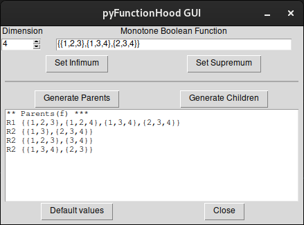

pyFunctionHood: local computation of immediate neighbours of a given monotone non-degenerate Boolean function
=================================================================================

This Python library implements the set of rules described in [arxiv:2407.01337](https://arxiv.org/abs/2407.01337), to compute the immediate neighbours of a given monotone non-degenerate Boolean function, without the need to generate the whole function space.

Here, immediate neighbours, are the monotone Boolean functions that are immediately above (or below) with respect to the partial order, in other words, are the functions that add/remove the minimum number of entries in the truth table.

Monotone non-degenerate Boolean functions are represented as sets of clauses, where each clause is represented by the bitarray data structure, and each bit represents the presence/absence of a given variable/regulator. 

This work corrects and extends our previous work available in [https://github.com/ptgm/functionhood/](https://github.com/ptgm/functionhood/), developed in Java, and described in [arxiv:1901.07623](https://arxiv.org/abs/1901.07623).

Given a reference monotone Boolean function, this library can be used in three distinct manners:
- in the command line passing the reference function as an argument
- using a graphical interface developed with Tkinter.
- as a library integrated in other tools

---

Usage - command line 
--------------------
```
Usage example: python main.py <type> <dimension> <function>
 <type>:      [p]arents or [c]hildren
 <dimension>: 4
 <function>:  "{{1,2,3},{1,3,4},{2,3,4}}"
```

**Parents**

To compute the parents (the functions immediately above) of a given monotone Boolean function, on can call:
```
python main.py p 4 "{{1,2,3},{1,3,4},{2,3,4}}"
R1 {{1,2,3},{1,2,4},{1,3,4},{2,3,4}}
R2 {{1,3},{2,3,4}}
R2 {{1,2,3},{3,4}}
R2 {{1,3,4},{2,3}}
```
which yields one parent function generated by Rule 1 (adding a maximal independent clause), and three parent functions generated by Rule 2 (collapsing pairs of clauses).

**Children**

To compute the children (the functions immediately below) of a given monotone Boolean function, one just change the first parameter:
```
python main.py c 4 "{{1,2,3},{1,3,4},{2,3,4}}"
R1 {{1,3,4},{2,3,4}}
R1 {{1,2,3},{1,3,4}}
R1 {{1,2,3},{2,3,4}}
```

---

Usage - Graphical interface
---------------------------

There is also a graphical interface using Tkinter where the user can define the function dimension and write the desired monotone Boolean function.



The interface has a button to automatically write the Infimum function of the chosen dimension, and another for the Supremum function.

The user has two buttons to generate the immediate neighbouring functions: **Generate Parents** to generate the list of parent functions, and **Generate Children** to generate the list of children functions.

In the text area the immediate neighbouring functions are shown, as well as any error if an invalid function is provided.

The button **Default values** cleans the text area and resets the input text boxes to their default values.

The button **Close** closes the application.

---

Usage - programmatically
------------------------

If you are using this library directly you should first initialise the Hasse Diagram with a given dimension as a parameter (example below considers monotone Boolean functions of **4** variables/regulators):
```
from hassediagram import *
hd = HasseDiagram(4)
```

Then to initialise a function one can use a set of Clauses, where each Clause is a String representing the regulators that are present ("1") or absent ("0"), of dimension **4**:
```
f = Function(4, {Clause('1110'), Clause('1011'), Clause('0111')})
```
or equivalently constructing the Function from its String representation:
```
f = Function.fromString(4, "{{1,2,3},{1,3,4},{2,3,4}}")
```

Once the Hasse Diagram and the function are defined, the method `hd.get_f_parents(f)` or `hd.get_f_children(f)` can be called, each returning a tuple of three sets of functions.
The functions generated by Rule 1, by Rule 2 and by Rule 3, respectively.
Below an example for parent functions generation:
```
s1, s2, s3 = hd.get_f_parents(f)
print(f'# parents from Rule1:{len(s1)} Rule2:{len(s2)} Rule3:{len(s3)}')
print('\n'.join(['R1 ' + str(f) for f in s1]\
              + ['R2 ' + str(f) for f in s2]\
              + ['R3 ' + str(f) for f in s3]))
```

---

License
-------

This code is available under GPL-3.0.

Cite
----

This work is available on [arxiv:2407.01337](https://arxiv.org/abs/2407.01337).

Authors
-------

- Patrícia Roxo
- José E. R. Cury
- Vasco Manquinho
- Claudine Chaouiya
- Pedro T. Monteiro
